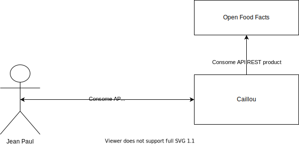

# Caillou

## 1 - Objectifs du TP 
L'objectif de ce TP est de réaliser une application Spring Boot permettant d'obtenir des informations nutritionnelles de différents produits.  

Cette application permettra aux utilisateurs de connaitre les performances nutritionnelles d'un produit. Pour cela, elle utilisera des données d'Open Food Facts, une API publique fournissant les informations de bases. A partir de ces données l'application effectuera des calculs permettant de faire l'analyse nutritionnelle du produit.  

Vous aurez donc en charge de développer l'application en vous basant sur Spring Boot et sur n'importe qu'elle autre librairie Java disponible. 

## 2 - Présentation de l'application
Il existe une application mobile bien connue, Yuka, permettant d'obtenir les informations nutritives d'un produit en scannant son code barre. Le produit en question est noté et qualifié (Excellent, Bon, Mauvais, Mediocre). C'est très pratique lorsque vous allez faire vos courses en magasin, un peu moins lorsque vous passez par un drive.  

Afin de faire bénéficier du même type de service les clients des drives, vous allez construire une appication exposant une API REST permettant d'obtenir toutes les informations nutritionnelles d'un produit ainsi que son score nutritionnel associé. Exposer ses informations sous forme d'une API REST permettra aux differents drives de pouvoir facilement intégrer ces données sur leurs plateformes.  

De plus, afin de fournir un service encore plus intéressant pour l'utilisateur final, votre application devra enregistrer les données des consomateurs afin de pouvoir à terme leur fournir des services plus complets comme des analyses de paniers, des analyses mensuelles voir des conseils personnalisés sur leur alimentation.  

Pour fournir toutes ces informations, votre application utilisera les données d'Open Food Facts. Elles sont accessibles via une API que vous aurez à interroger.

## 3 - Overview



## 4 - USer stories attendues 

### US 1 : Récuperer les informations nutritionnelles d'un produit

>En tant que client du drive, je souhaite pouvoir disposer des informations d'Open Food Fact sur un produit afin de pouvoir faire des choix de consomation éclairés.

Votre application devra donc utiliser l'API d'Open Food Fact afin de récupérer les informations d'un produit donné. 

L'API est disponible à l'adresse suivante :  
https://fr.openfoodfacts.org/data  
Exemple pour le code barre 7622210449283 : https://fr.openfoodfacts.org/api/v0/produit/7622210449283.json  
La documentation de l'API est diponible ici : https://en.wiki.openfoodfacts.org/API  

Vous avez le choix du client HTTP. Spring fournit une classe RestTemplate simplifiant la consomation d'un API REST, mais vous pouvez également utiliser d'autres clients HTTP (OkHttp, Retrofit, Apache HttpClient, client natif Java 11) ainsi que d'autres librairies JSON (Json-B, Jackson, Genson, Gson). Dans tout les cas pensez aux tests.

Pour info Open Food Facts et un service gratuit, pour l'instant. 


### US 2 : Score nutritionel

>En tant que client du drive, je souhaite avoir un score nutritionnel afin de pouvoir faire des choix de consomation éclairés.

Votre application exposera une API REST et en respectera donc les conventions. Cette API se matérialisera par un endpoint fournissant le score nutritionnel d'un produit dont le code barre sera fournit.  

```json
GET /product/7622210449283

{
    "id": 0,
    "barCode": "7622210449283",
    "name": "Biscuits fourrés parfum chocolat (35%) - Prince Goût Chocolat au Blé Complet",
    "nutritionScore": 9
}
```


##### Calcul du Score nutritionnel
Basé sur les infos de l'API d'Open Food Fact pour un produit donné, calculez la composante N (Négative) du score nutrionnel.  
Calculez la composante P (Positive) du score nutrionnel.  
Basé sur les composantes N et P, votre application calculera un score nutritionnel en accord avec les spécifications données dans la partie 7.  

### US 3 : Classement de l'aliment

>En tant que client du drive, je souhaite pouvoir disposer d'indicateurs simples me permettant de facilement évaluer le produit afin de pouvoir faire des choix de consomation éclairés.

Faites evoluer votre API pour intégrer la classe de l'aliment et le code couleur associé. Vous trouverez les détails dans la section 8.

```json
GET /product/7622210449283

 {
    "id": 0,
    "barCode": "7622210449283",
    "name": "Biscuits fourrés parfum chocolat (35%) - Prince Goût Chocolat au Blé Complet",
    "nutritionScore": 9,
    "classe" : "Mangeable",
    "color" : "yellow"
 }

```


### US 4 : Synthèse de panier
>En tant que client du drive, je souhaite pouvoir connaitre le score nutritionnel de mon panier.

Votre application fournira une synthèse d'un panier donné afin de fournir à un consomateur un résumé du panier qu'il s'apprete à commander. Cette synthèse est une aggregation du score et des classes des produits composant le panier.  

Vous devrez exposer tous les endpoints nécessaires à la gestion d'un panier.   

Les utilisateurs seront identifiés par leur adresse email.


### [Facultatif] US 5 : Gestion des additifs
>En tant que client du drive, je souhaite pouvoir connaitre les additifs toxiques présents dans les produits que je selectionne.

Afin de mieux renseigner le consommateur, votre application devra indiquer si un produit est composé d'additifs potentiellement dangereux. Vous trouverez dans ce repository un fichier csv listant les principaux additifs ainsi que leur niveau de toxicité.  


### [Facultatif] US 6 : Documentation de l'API REST générée en automatique
Qui dit API, dit documentation. Sans documentation, impossible d'utiliser votre API. Donc API inutile.  


## 5 - Contraintes techniques 
Votre application exposera donc une API REST, elle devra à ce titre en respecter les conventions. Le format d'échange sera le JSON.  
Vous utiliserez le framework Spring Boot pour réaliser cette application. Si aucune version n'est imposé, je vous conseille de prendre la plus récente.  

Le choix de la base de données est laissé à votre discretion. H2 à l'avantage d'avoir un mode in-memory bien pratique pour les premières phases de développement, néanmoins ce choix n'est pas imposé ! D'ailleurs vous n'êtes pas obligés de choisir une DB relationnelle.  

Enfin, aucune contrainte n'est imposé sur les choix des librairies à utilisé dans vore application, ce qui veut dire que vous pouvez utiliser n'importe quelle librairie qui vous facilitera la vie.  

L'utilisation de Maven est obligatoire. La version de Java est à votre discretion. La LTS la plus récente est la 17, mais la 11 est la plus répandue.


## 6 - Evaluation
L'application à réaliser étant assez simple, la complétude sera évalué. Mais réaliser entièrement l'application ne sera pas suffisant puisque d'autres points seront évalués :
- **Le niveau de test** : Une application non testé ne peut pas être déployée en production sans prendre de risques importants. Et une application qui n'est pas en production est une application qui ne sert à rien. Donc tests unitaires et bonne couverture de test **obligatoire**.
- L'organisation du code : Nous n'en sommes qu'au début, mais pensez déjà à la modularité de votre code. Identifier les acteurs et les responsabilités afin d'anticiper les raisons qui pousserait votre code à changer (raisons techniques, fonctionnelles, légales...). Faite cela pour chaque chaque module, classe et fonction. Répéter ce processus de manière itérative, en remodifiant votre code pour obtenir une meilleure modularité. Imaginez que votre application soit faite pour durer plusieurs années, que pourrait-il se passer ?
- Le niveau de couplage : Un trop haut niveau de couplage entre les copmposants d'une application empechera celle-ci d'evoluer facilement. Trouvez des solutions pour avoir un niveau de couplage faible. Penez à tout ce que vous offre la POO, les designs patterns, le langage (interfaces...)
- L'utilisation de Spring Boot : SB vous fournit un cadre de travail ainsi que différentes fonctionalités vous permettant de développer rapidement et proprement votre application. Autant s'en servir. L'utilisation de l'injection de dépendances de SB sera scruté avec intéret !

Pour ce TP, la clarté du code sera également évalué. Indentation, nommage des variables, classes, méthodes... et commentaires sont vos amis.


## 7 - Score nutritionnel

Le score nutritionnel des aliments repose sur le calcul d’un score unique et global prenant en compte, pour chaque aliment :

- une composante dite « négative » N,

- une composante dite « positive » P

  

### Composante Negative N

La composante N du score prend en compte les éléments nutritionnels dont il est recommandé
de limiter la consommation : densité énergétique (apport calorique en kJ pour 100 g d’aliment),
teneurs en acides gras saturés (AGS), en sucres simples (en g pour 100g d’aliment) et en sel (en
mg pour 100g d’aliment). Sa valeur correspond à la somme des points attribués, de 1 à 10, en
fonction de la teneur de la composition nutritionnelle de l’aliment (cf. tableau 1). La note pour la
composante N peut aller de 0 à 40.

Tableau 1 : Points attribués à chacun des éléments de la composante dite « négative » N  

| Points | Densité énergétique (kJ/100g) (energy_100g) | Graisses saturées (g/100g) (saturated-fat_100g) | Sucres simples (g/100g) (sugars_100g) | Sodium1 (mg/100g) (salt_100g) |
| ------ | ----------------------------- | -------------------------- | ----------------------- | ----------------- |
| 0      | < 335                         | < 1                        | < 4,5                   | < 90              |
| 1      | > 335                         | > 1                        | > 4,5                   | > 90              |
| 2      | > 670                         | > 2                        | > 9                     | > 180             |
| 3      | > 1005                        | > 3                        | > 13,5                  | > 270             |
| 4      | > 1340                        | > 4                        | > 18                    | > 360             |
| 5      | > 1675                        | > 5                        | > 22,5                  | > 450             |
| 6      | > 2010                        | > 6                        | > 27                    | > 540             |
| 7      | > 2345                        | > 7                        | > 31                    | > 630             |
| 8      | > 2680                        | > 8                        | > 36                    | > 720             |
| 9      | > 3015                        | > 9                        | > 40                    | > 810             |
| 10     | > 3350                        | > 10                       | > 45                    | > 900             |


### Composante Negative P

La composante P est calculée, en fonction de la teneur de l’aliment en fibres et en protéines (exprimées en g pour 100 g d’aliment). Pour chacun de ces éléments, des points, allant de 1 à 5 sont attribués en fonction de leur teneur dans l’aliment (cf. tableau 2). La composante positive P du score nutritionnel est la note correspondant à la somme des points définis pour ces deux éléments : cette note est donc comprise entre 0 et 10.  

Tableau 2 : Points attribués à chacun des nutriments de la composante dite « positive » P  

| Points | Fibres (g/100g) (fiber_100g) | Protéines (g/100g) (proteins_100g) |
| ------ | --------------- | ------------------ |
| 0      | < 0,9           | < 1,6              |
| 1      | > 0,9           | > 1,6              |
| 2      | > 1,9           | > 3,2              |
| 3      | > 2,8           | > 4,8              |
| 4      | > 3,7           | > 6,4              |
| 5      | > 4,7           | > 8,0              |

Calcul du score nutritionnel  
Le calcul final du score nutritionnel se fait en soustrayant à la note de la composante négative N la note de la composante positive P avec quelques conditionnalités décrites ci après.  


### Calcul du score nutritionnel

**Score nutritionnel = Total Points N – Total Points P**

La note finale du score nutritionnel attribuée à un aliment est	 donc susceptible d’être comprise entre une valeur théorique de - 10 (le plus favorable sur le plan nutritionnel) et une valeur théorique de + 40 (le plus défavorable sur le plan nutritionnel).  


### Data
Un fichier data.sql reprenant les données précédentes vous est fourni, vous pouvez vous en servir pour gagner du temps.


## 8 - Classement nutritionnel
Classement de l’aliment dans l’échelle nutritionnelle à cinq niveaux sur la base du score calculé  

| Classe    | Bornes du score | Couleur     |
| --------- | --------------- | ----------- |
| Trop Bon  | Min à -1        | green       |
| Bon       | 0 à 2           | light green |
| Mangeable | 3 à 10          | yellow      |
| Mouai     | 11 à 18         | orange      |
| Degueu    | 19 à Max        | red         |
